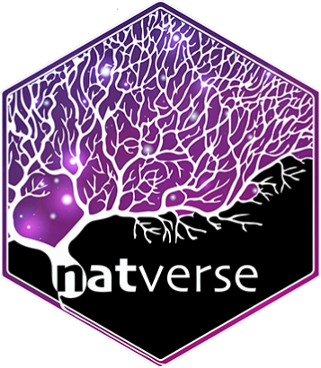

<!-- README.md is generated from README.Rmd. Please edit that file -->

```{r, include = FALSE}
knitr::opts_chunk$set(
  collapse = TRUE,
  comment = "#>",
  fig.path = "man/figures/README-",
  out.width = "100%"
)
```

# natverse <a href='https://natverse.github.io/'></a>

<!-- badges: start -->
<!-- badges: end -->

The goal of natverse is to install all of the commonly used NeuroAnatomy Toolbox packages.

See https://natverse.github.io for more details.

## Installation

You can install the latest version as shown below:

```r
if(!requireNamespace('remotes')) install.packages('remotes')
remotes::install_github("natverse/natverse")
```

Once installed, you can update natverse and all its dependencies like so:

```r
remotes::update_packages('natverse')
```
This will ask you to confirm whether you want to update dependencies (and their dependencies).

If want to upgrade all dependencies without answering any questions:

```r
remotes::update_packages('natverse', upgrade='always')
```

## Example

This will load the `natverse` package:

```{r example}
library(natverse)
```

Conflicts between functions added to the search path by loading the `natverse` and equivalently named functions in other packages can by running:

```{r conflicts}
natverse_conflicts()
```

You can check if all the packages within `natverse` are up to date with:

1.For dependencies installed via CRAN use

```{r updates_CRAN}
natverse_update(source = 'CRAN')
```

2.For dependencies installed via GitHub use
```{r updates_GitHub}
natverse_update(source = 'GITHUB')
```

