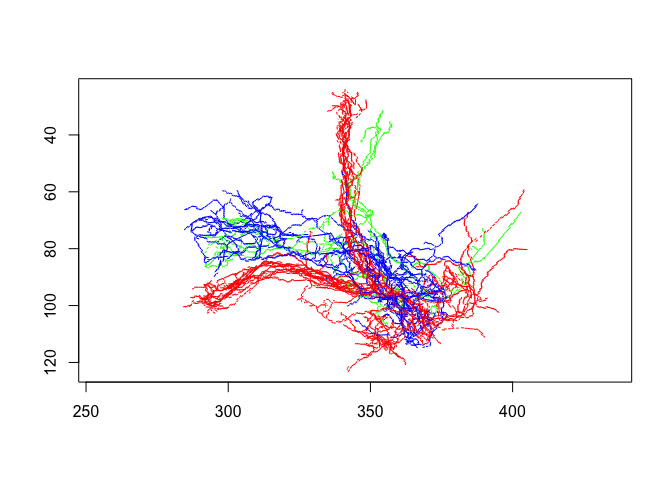

<!-- README.md is generated from README.Rmd. Please edit that file -->

# natverse <a href='https://natverse.github.io/'></a>

<!-- badges: start -->

[](https://natverse.github.io)
[](https://natverse.github.io/natverse/reference/)
[](https://travis-ci.org/natverse/natverse)
<!-- badges: end -->

The natverse package is a wrapper for all of the commonly used
NeuroAnatomy Toolbox packages. This is convenient both for package
installation and for loading/attaching these packages without many calls
to `library()`.

See <http://natverse.org> for more details.

## Installation

The recommended approach to install the full natverse is to use a helper
package natmanager, which is available on CRAN. You can therefore do:

``` r
install.packages("natmanager")
natmanager::install("natverse")
```

See <http://natverse.org/install> for more details.

## Use

Once installed, you can load the `natverse` package:

``` r
library(natverse)
#> Loading required package: elmr
#> Loading required package: catmaid
#> Loading required package: httr
#> Loading required package: nat
#> Loading required package: rgl
#> Registered S3 method overwritten by 'nat':
#>   method             from
#>   as.mesh3d.ashape3d rgl
#> 
#> Attaching package: 'nat'
#> The following object is masked from 'package:rgl':
#> 
#>     wire3d
#> The following objects are masked from 'package:base':
#> 
#>     intersect, setdiff, union
#> Loading required package: nat.flybrains
#> Loading required package: nat.templatebrains
#> Loading required package: nat.nblast
# example 3D plot of some neurons
plot(kcs20, col=type)
```



## Installation Details

### Conflicts and Dependencies

The natverse package contains many packages and it is possible that
there could be conflicts where functions in the natverse have the same
name as another package.

``` r
natverse_conflicts()
#> ── Conflicts ──────────────────────────────────── natverse_conflicts() ──
#> x nat::intersect() masks base::intersect()
#> x nat::setdiff()   masks base::setdiff()
#> x nat::union()     masks base::union()
#> x nat::wire3d()    masks rgl::wire3d()
```

You can always choose the correct version by prepending the specific
package name e.g. `nat::flip()` will select the nat version rather than
any other.

### Updates

Once installed, you check the status of all natverse packages and their
dependencies like so:

``` r
natverse_update()
#> 
#> package: isoband was not found
#> 
#> The following packages are either locally installed or information about them is missing!
#> 
#>   fafbsegdata, neuprintr
#> 
#> Please install them manually from their appropriate source locations
#> 
#> The following natverse dependencies are missing!
#> 
#>   isoband
#> 
#> We recommend installing them by running:
#> natverse_update(update=TRUE)
#> 
#> The following natverse dependencies are out-of-date, see details below:
#> 
#> We recommend updating them by running:
#> natverse_update(update=TRUE)
#> 
#> package      remote         local          source   repo                        status      
#> -----------  -------------  -------------  -------  --------------------------  -------     
#> covr         3.5.0          3.4.0          CRAN     https://cran.rstudio.com/   x           
#> dplyr        0.8.5          0.8.4          CRAN     https://cran.rstudio.com/   x           
#> fafbseg      265230190...   47c8b459b...   GitHub   jefferis                    x           
#> ggplot2      3.3.0          3.2.1          CRAN     https://cran.rstudio.com/   x           
#> isoband      0.2.0          NA             CRAN     https://cran.rstudio.com/   ❓      
#> Morpho       2.8            2.7            CRAN     https://cran.rstudio.com/   x           
#> plyr         1.8.6          1.8.5          CRAN     https://cran.rstudio.com/   x           
#> reticulate   1.14           1.13           CRAN     https://cran.rstudio.com/   x           
#> vctrs        0.2.4          0.2.3          CRAN     https://cran.rstudio.com/   x           
#> xml2         1.2.5          1.2.2          CRAN     https://cran.rstudio.com/   x
```

You can then update like so:

``` r
natverse_update(update = TRUE)
```

However, if you are in a hurry and want to save time from the questions
use like below:

``` r
natverse_update(update=TRUE, upgrade = 'always')
```

If want to upgrade the natverse package itself:

``` r
remotes::update_packages('natverse')
```
